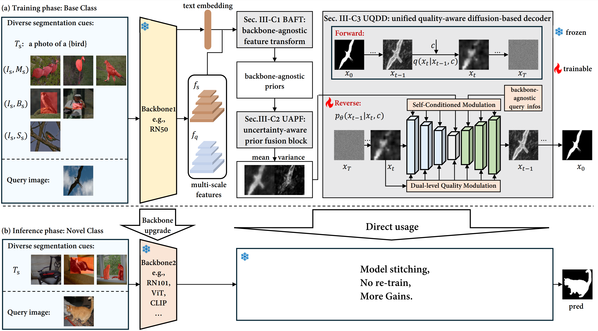

# DiffUp

code for paper: No Re-Train, More Gain: Upgrading Backbones with Diffusion Model for Few-Shot Segmentation. [Link to paper](https://arxiv.org/abs/2407.16182)

## Abstract

Few-Shot Segmentation (FSS) aims to segment novel classes using only a few annotated images. Despite considerable process under pixel-wise support annotation, current FSS methods still face three issues: the inflexibility of backbone upgrade without re-training, the inability to uniformly handle various types of annotations (e.g., scribble, bounding box, mask and text), and the difficulty in accommodating different annotation quantity. To address these issues simultaneously, we propose DiffUp, a novel FSS method that conceptualizes the FSS task as a conditional generative problem using a diffusion process. For the first issue, we introduce a backbone-agnostic feature transformation module that converts different segmentation cues into unified coarse priors, facilitating seamless backbone upgrade without re-training. For the second issue, due to the varying granularity of transformed priors from diverse annotation types, we conceptualize these multi-granular transformed priors as analogous to noisy intermediates at different steps of a diffusion model. This is implemented via a self-conditioned modulation block coupled with a dual-level quality modulation branch. For the third issue, we incorporates an uncertainty-aware information fusion module that harmonizing the variability across zero-shot, one-shot and many-shot scenarios. Evaluated through rigorous benchmarks, DiffUp significantly outperforms existing FSS models in terms of flexibility and accuracy. 

## framework



## Code will be released!


## Prepare the Datasets

Enter the `data` directory, create and enter the directory `coco` and download the COCO 2017 train and val images and the COCO 2014 annotations from the [COCO website](https://cocodataset.org/#download):

```bash
cd data
mkdir coco
cd coco
wget http://images.cocodataset.org/zips/train2017.zip
wget http://images.cocodataset.org/zips/val2017.zip
wget http://images.cocodataset.org/annotations/annotations_trainval2014.zip
```

Unzip the files:

```bash
unzip train2017.zip
unzip val2017.zip
unzip annotations_trainval2014.zip
rm -rf train2017.zip val2017.zip annotations_trainval2014.zip
```

The `coco` directory should now contain the following files and directories:

```
coco
├── annotations
│   ├── captions_train2014.json
│   ├── captions_val2014.json
│   ├── instances_train2014.json
│   ├── instances_val2014.json
|   ├── person_keypoints_train2014.json
|   └── person_keypoints_val2014.json
├── train2017
└── val2017
```

Now, join the images of the train and val sets into a single directory:

```bash
mv val2017/* train2017
mv train2017 train_val_2017
rm -rf val2017
```

Finally, you will have to rename image filenames in the COCO 2014 annotations to match the filenames in the `train_val_2017` directory. To do this, run the following script:

```bash
python main.py rename_coco20i_json --instances_path data/coco/annotations/instances_train2014.json
python main.py rename_coco20i_json --instances_path data/coco/annotations/instances_val2014.json
```

Setting up [PASCAL VOC 2012](http://host.robots.ox.ac.uk/pascal/VOC/) Dataset with augmented data.

### 1. Instruction to download
``` bash
bash data/script/setup_voc12.sh data/pascal
``` 
```bash
data/
└── pascal/
    ├── Annotations
    ├── ImageSets/
    │   └── Segmentation
    ├── JPEGImages
    ├── SegmentationObject
    └── SegmentationClass
``` 
### 2. Add SBD Augmentated training data
- Convert by yourself ([here](https://github.com/shelhamer/fcn.berkeleyvision.org/tree/master/data/pascal)).
- Or download pre-converted files ([here](https://github.com/DrSleep/tensorflow-deeplab-resnet#evaluation)), **(Prefer this method)**.

After the download move it into the pascal folder.

```bash
unzip SegmentationClassAug.zip -d data/pascal
```

```bash
data/
└── pascal/
    ├── Annotations
    ├── ImageSets/
    │   └── Segmentation
    ├── JPEGImages
    ├── SegmentationObject
    ├── SegmentationClass
    └── SegmentationClassAug #ADDED
``` 

### 3. Download official sets as ImageSets/SegmentationAug list
From: https://github.com/kazuto1011/deeplab-pytorch/files/2945588/list.zip

```bash
# Unzip the file
unzip list.zip -d data/pascal/ImageSets/
# Move file into Segmentation folder
mv data/pascal/ImageSets/list/* data/pascal/ImageSets/Segmentation/
rm -rf data/pascal/ImageSets/list
```

This is how the dataset should look like
```bash
/data
└── pascal
    ├── Annotations
    ├── ImageSets
    │   └── Segmentation 
    │       ├── test.txt
    │       ├── trainaug.txt # ADDED!!
    │       ├── train.txt
    │       ├── trainvalaug.txt # ADDED!!
    │       ├── trainval.txt
    │       └── val.txt
    ├── JPEGImages
    ├── SegmentationObject
    ├── SegmentationClass
    └── SegmentationClassAug # ADDED!!
        └── 2007_000032.png
```


## Citation
```bibtex
@article{chen2024no,
  title={No Re-Train, More Gain: Upgrading Backbones with Diffusion Model for Few-Shot Segmentation},
  author={Chen, Shuai and Meng, Fanman and Wu, Chenhao and Wei, Haoran and Zhang, Runtong and Wu, Qingbo and Xu, Linfeng and Li, Hongliang},
  journal={arXiv preprint arXiv:2407.16182},
  year={2024}
}
```